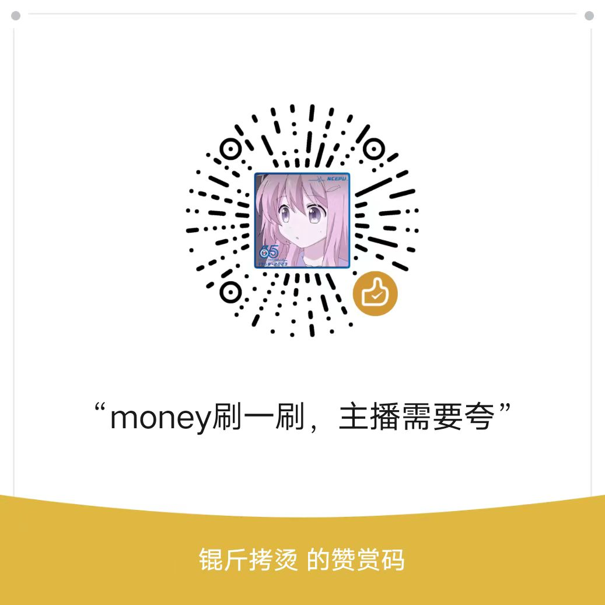

# sunrise-machine-learning-2024

Welcome to Sunrise Lab.

+ The [task](./tasks/) are some tasks before the next group meeting
+ The [tools](./tools) are some of the better tools I've ever used, you can share the better tools you have used.
+ The [learning_materials](./learning_materials/) are some of the materials that may be used.

## Machine Learning Code

You can visit [sunrise-machine-learning](https://github.com/ZhenhHuang/sunrise-machine-learning) to browse the lab's code.

---

Have fun learning

If you think it will help you, you can treat me to a cup of milk tea, thank you very much.

